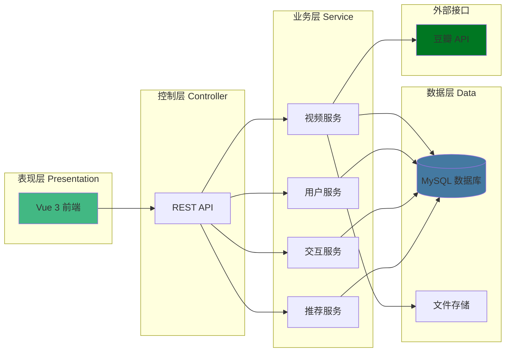
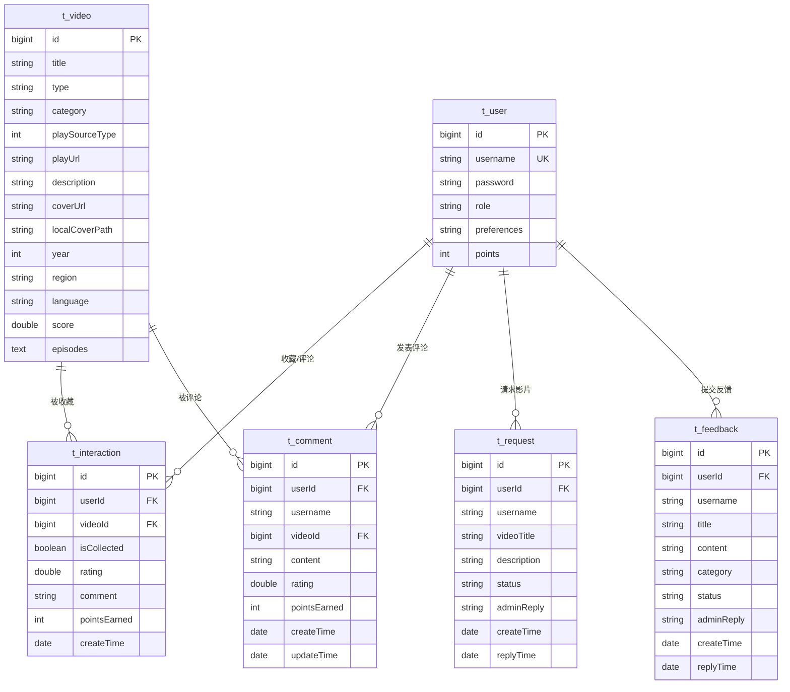
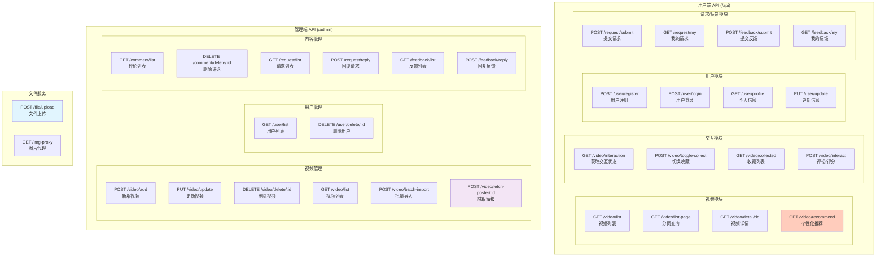
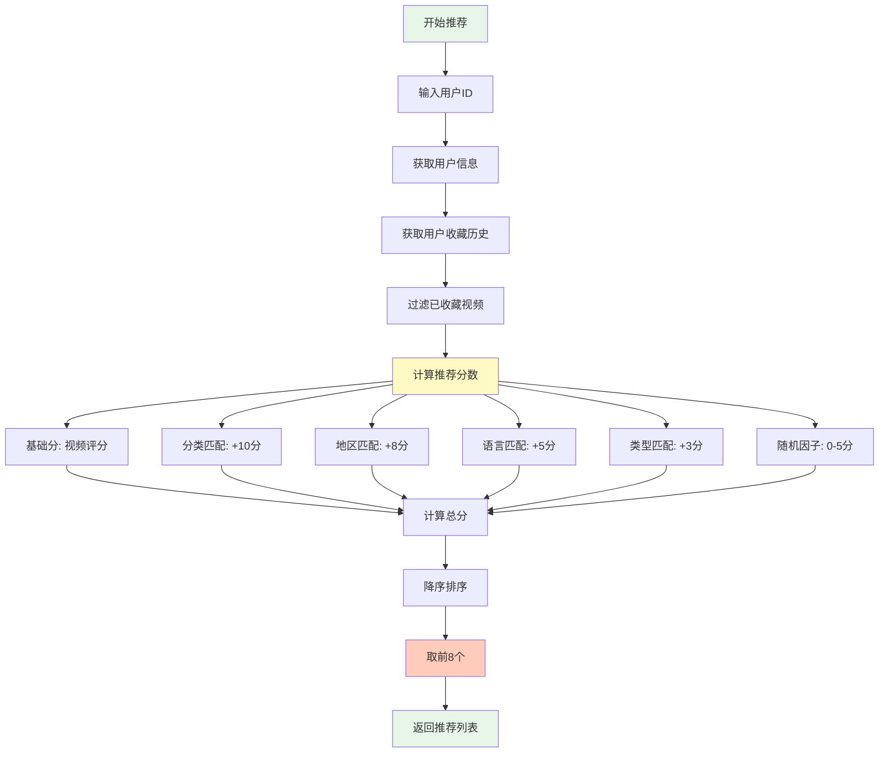

# 视频平台功能模块图

## 1. 系统完整功能模块图

```mermaid
graph TB
    subgraph "用户端 Frontend - User"
        Index[首页 index.html]
        Detail[详情页 detail.html]
        Profile[个人中心 profile.html]
        Login[登录页 login.html]
    end

    subgraph "管理端 Frontend - Admin"
        Admin[后台管理 admin.html]
    end

    subgraph "Controller 层"
        UserVideoController["/api/video<br>UserVideoController"]
        UserController["/api/user<br>UserController"]
        UserCommentController["/api/comment<br>UserCommentController"]
        UserRequestController["/api/request<br>UserRequestController"]
        FeedbackController["/api/feedback<br>FeedbackController"]

        AdminVideoController["/admin/video<br>AdminVideoController"]
        AdminManagerController["/admin/user<br>AdminManagerController"]
        AdminFeedbackController["/admin/feedback<br>AdminFeedbackController"]
        FileController["/api/file<br>FileController"]
        ImageProxyController["/img-proxy<br>ImageProxyController"]
    end

    subgraph "Service 层"
        VideoService[VideoService<br>视频服务]
        UserService[UserService<br>用户服务]
        CommentService[CommentService<br>评论服务]
        InteractionService[InteractionService<br>交互服务]
        RequestService[RequestService<br>请求服务]
        FeedbackService[FeedbackService<br>反馈服务]
        PosterService[PosterService<br>海报服务]
        CoverImageService[CoverImageService<br>封面服务]
    end

    subgraph "Repository 层"
        VideoRepository[VideoRepository]
        UserRepository[UserRepository]
        CommentRepository[CommentRepository]
        InteractionRepository[InteractionRepository]
        RequestRepository[RequestRepository]
        FeedbackRepository[FeedbackRepository]
    end

    subgraph "Entity 数据模型"
        Video[Video<br>影视]
        User[User<br>用户]
        Comment[Comment<br>评论]
        Interaction[Interaction<br>交互]
        Request[Request<br>请求]
        Feedback[Feedback<br>反馈]
    end

    subgraph "外部服务"
        DoubanAPI[豆瓣 API<br>海报获取]
    end

    subgraph "核心功能模块"
        VideoModule[📽️ 视频模块]
        UserModule[👤 用户模块]
        InteractionModule[💬 交互模块]
        RecommendModule[🎯 推荐模块]
        RequestModule[📝 请求模块]
        FeedbackModule[🔔 反馈模块]
        FileModule[📁 文件模块]
    end

    %% 前端到 Controller
    Index --> UserVideoController
    Detail --> UserVideoController
    Detail --> UserCommentController
    Profile --> UserController
    Profile --> UserRequestController
    Login --> UserController
    Admin --> AdminVideoController
    Admin --> AdminManagerController
    Admin --> AdminFeedbackController

    %% Controller 到 Service
    UserVideoController --> VideoService
    UserController --> UserService
    UserCommentController --> CommentService
    UserCommentController --> InteractionService
    UserRequestController --> RequestService
    FeedbackController --> FeedbackService
    AdminVideoController --> VideoService
    AdminVideoController --> PosterService
    AdminManagerController --> UserService
    AdminFeedbackController --> FeedbackService
    FileController --> VideoService
    ImageProxyController --> CoverImageService

    %% Service 到 Repository
    VideoService --> VideoRepository
    UserService --> UserRepository
    CommentService --> CommentRepository
    InteractionService --> InteractionRepository
    RequestService --> RequestRepository
    FeedbackService --> FeedbackRepository
    PosterService --> CoverImageService

    %% Repository 到 Entity
    VideoRepository --> Video
    UserRepository --> User
    CommentRepository --> Comment
    InteractionRepository --> Interaction
    RequestRepository --> Request
    FeedbackRepository --> Feedback

    %% 外部服务
    PosterService --> DoubanAPI

    %% 功能模块关联
    VideoService -.-> VideoModule
    UserService -.-> UserModule
    InteractionService -.-> InteractionModule
    VideoService -.-> RecommendModule
    RequestService -.-> RequestModule
    FeedbackService -.-> FeedbackModule
    FileController -.-> FileModule

    style Index fill:#e1f5fe
    style Admin fill:#fff3e0
    style VideoModule fill:#f3e5f5
    style UserModule fill:#e8f5e9
    style InteractionModule fill:#fff9c4
    style RecommendModule fill:#ffccbc
    style DoubanAPI fill:#b2dfdb
```

---

## 2. 精简版功能架构图

---

## 3. 数据库关系图

---

## 4. API 接口模块图

---

## 5. 推荐算法流程图

---

## 如何查看这些图表

### 方式一：在线预览
1. 访问 [Mermaid Live Editor](https://mermaid.live/)
2. 将上述任意代码块复制粘贴进去
3. 即可看到渲染后的图表

### 方式二：本地编辑器
- **Typora**：原生支持 Mermaid，直接预览
- **VS Code**：安装 "Markdown Preview Mermaid Support" 插件
- **Obsidian**：原生支持

### 方式三：GitHub/GitLab
将此文件推送到 GitHub 或 GitLab，平台会自动渲染 Mermaid 图表

---

## 项目技术栈

| 层级 | 技术 |
|------|------|
| 前端 | Vue 3 + Axios + 原生 JS |
| 后端 | Spring Boot 4.0.1 + Spring Data JPA |
| 数据库 | MySQL |
| 工具 | Lombok, org.json |
| 外部API | 豆瓣 API (海报获取) |
