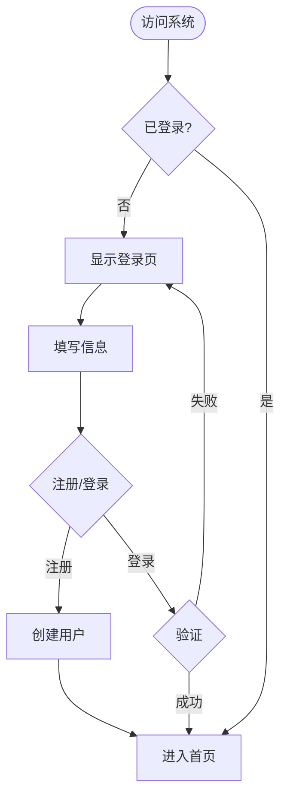
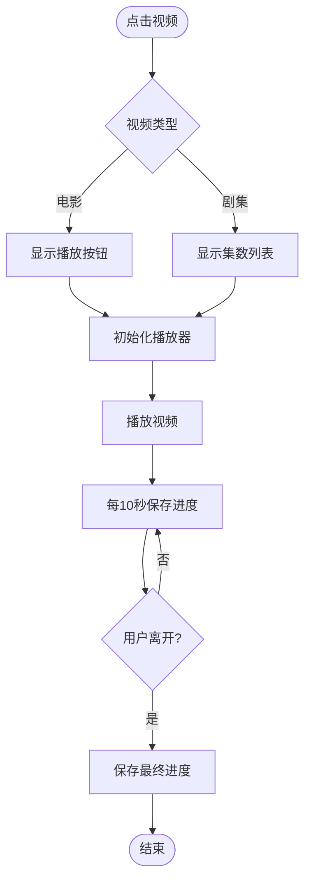
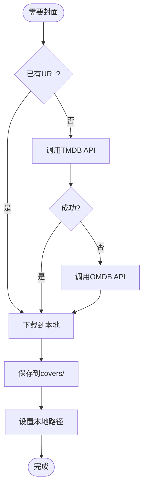
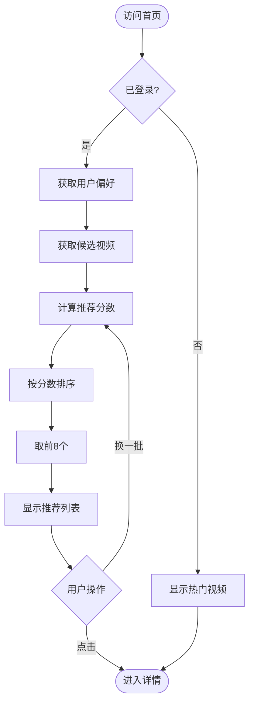
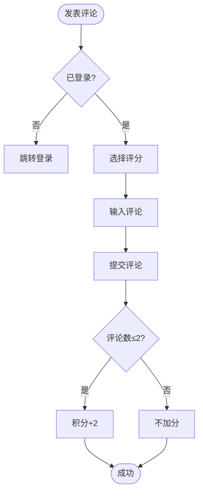
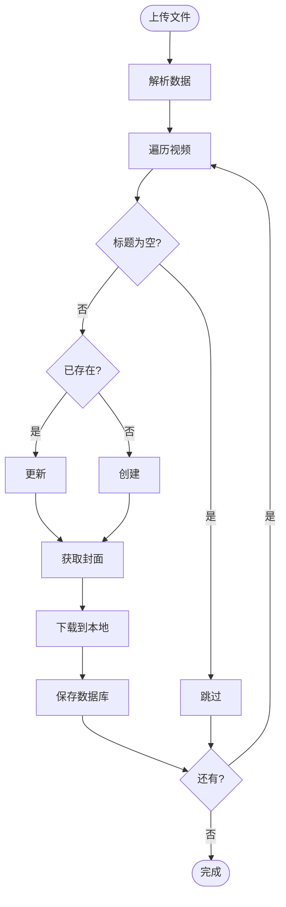
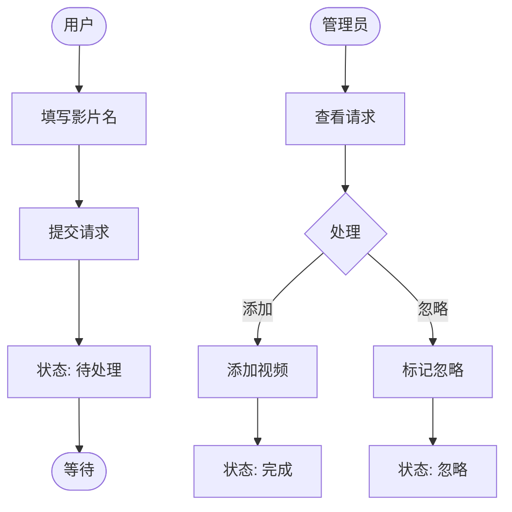
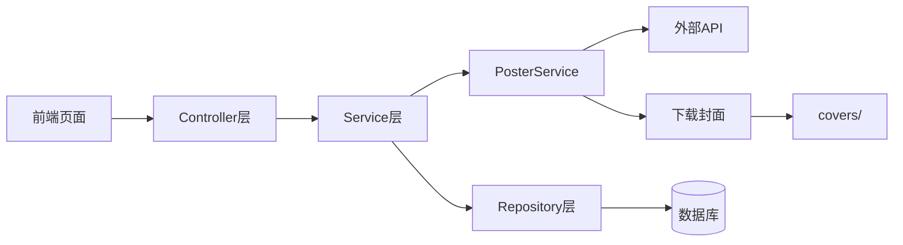
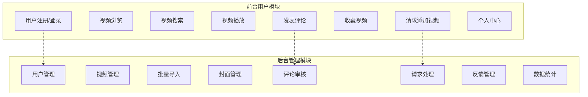
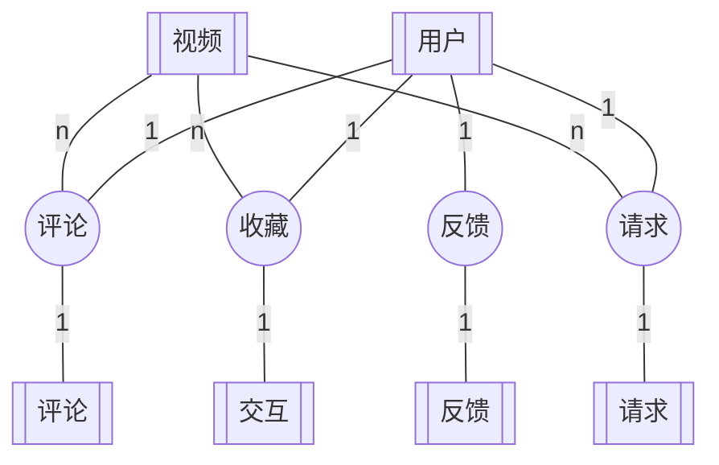

# 视频平台项目流程图

---

## 项目整体功能结构

### 前台用户模块

| 功能 | 说明 |
|------|------|
| 用户认证 | 注册、登录 |
| 视频浏览 | 首页推荐、分类筛选 |
| 视频搜索 | 关键词、多条件筛选 |
| 视频播放 | 电影/剧集播放、进度记录 |
| 互动功能 | 评论评分、收藏 |
| 用户请求 | 请求添加新视频 |
| 个人中心 | 收藏、观看历史 |

### 后台管理模块

| 功能 | 说明 |
|------|------|
| 视频管理 | 增删改查 |
| 批量导入 | JSON文件导入 |
| 封面管理 | 自动获取、本地缓存 |
| 评论审核 | 审核评论、扣除积分 |
| 请求处理 | 处理用户请求 |
| 反馈管理 | 查看用户反馈 |
| 数据统计 | 视频/用户/评论统计 |

### 核心功能

- 📺 在线播放：支持电影和剧集
- 🎬 智能封面：多源获取、本地缓存
- ⭐ 个性推荐：基于用户偏好
- 💬 评论积分：评分评论、奖励机制
- 📝 请求添加：用户驱动内容扩展

---

## 使用方法

访问 https://mermaid.live 粘贴代码预览

---

## 1. 用户登录注册

---

## 2. 视频播放

---

## 3. 封面获取存储

---

## 4. 个性化推荐

---

## 5. 评论积分

---

## 6. 批量导入

---

## 7. 请求添加视频

---

## 8. 系统架构

---

## 9. 功能模块图

---

## 10. 系统 E-R 图

---

*版本: v6.0 (精简版)*
